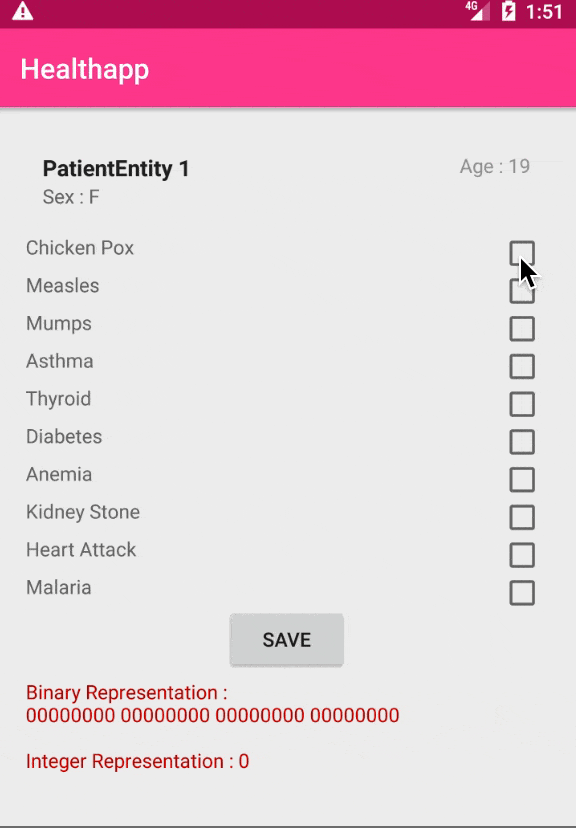

# HealthApp using BitwiseShifting
This demo app shows how to use 1 Integer value to store upto 32 booleans. Find the reference [article here][1]


### Using Bit values 
Idea is to utilise every bit inside an Integer for boolean representation. 1 Integer = 32 bits so we have 32 possible variables which coulde be either 1 or 0. By setting bit value of given position we will make it 1 which is True and by resetting we will make bit value at that position to 0 which is false.

## Preview
<p align="center">
  
</p>

### How to set bit Value to TRUE :
```java
public class SetAppUpdateAvailable {

    private int mUpdateValue = 0;

    private static final int UPDATE_AVAILABLE = 1;
    private static final int UPDATE_COMPULSORY = 2;

    public void setUpdateAvailable(){
        mUpdateValue = mUpdateValue | (1 << UPDATE_AVAILABLE);
    }
}
```

### How to get bit value :
```java
public class GetAppUpdateAvailable {

    private int mUpdateValue = 0b0010;
    
    private static final int UPDATE_AVAILABLE = 1;
    private static final int UPDATE_COMPULSORY = 2;

    public void getUpdateAvailable(){
        boolean result = (mUpdateValue & (1 << UPDATE_AVAILABLE)) != 0;
    }
}
```

This way we can store upto 32 boolean values into 1 integer. 

### Want to store more than 32 boolean values ?
In this case you can change variable type to ```Long``` which will give you 64 bits. You need more than that ? Then consider using ``` long[] ``` of size ```n``` It should work for you. 


1. [SingleIntBitmaskHandler][2]
2. [SingleLongBitmaskHandler][3]
3. [MutlipleLongBitmaskHandler][4]


[1]: https://medium.com/@nieldeokar/how-to-store-32-booleans-in-1-int-android-ff14dc8d4e38
[2]: https://github.com/nieldeokar/HealthApp/blob/master/app/src/main/java/com/nileshdeokar/healthapp/utils/SingleIntBitMaskHandlerJava.java
[3]: https://github.com/nieldeokar/HealthApp/blob/master/app/src/main/java/com/nileshdeokar/healthapp/utils/SingleLongBitMaskHandler.java
[4]: https://github.com/nieldeokar/HealthApp/blob/master/app/src/main/java/com/nileshdeokar/healthapp/utils/MultipleLongArrayBitMaskHandler.kt
